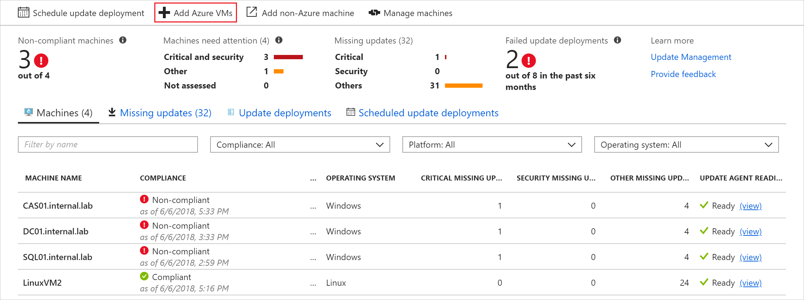
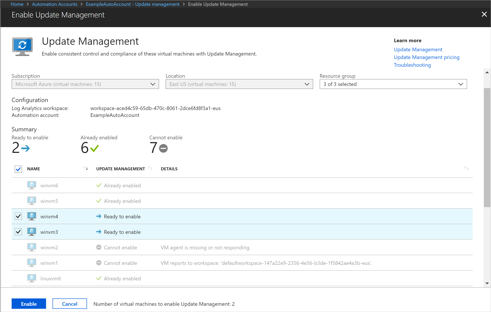
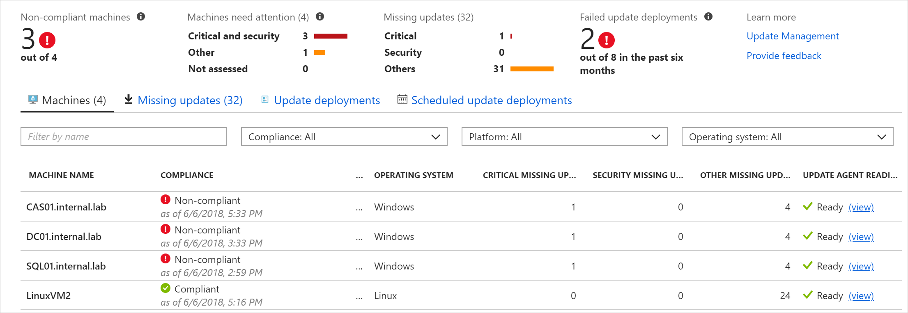
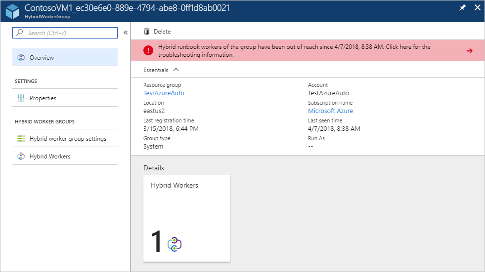
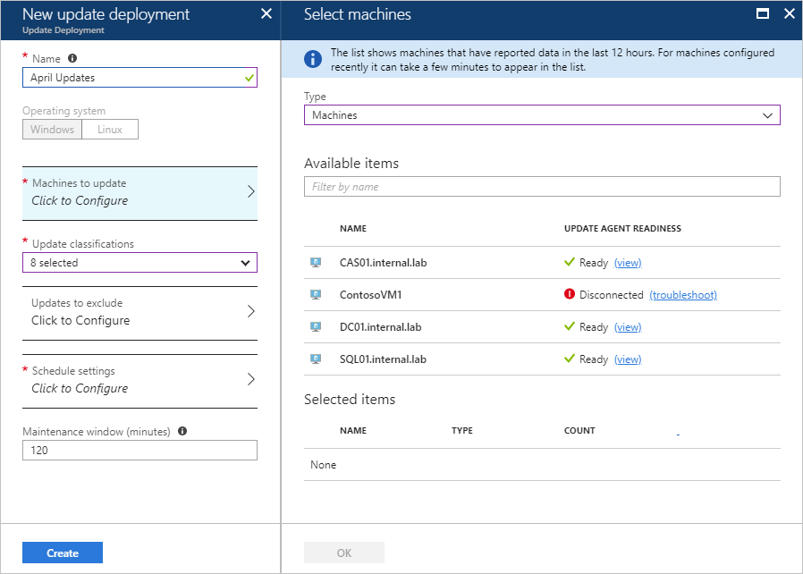
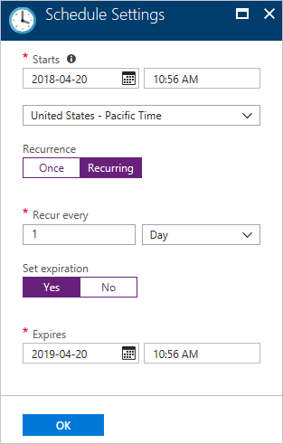

# Manage updates for multiple machines

You can use update management to manage updates and patches for your Windows and Linux virtual machines. From your [Azure Automation](automation-offering-get-started.md) account, you can:

- Onboard virtual machines.
- Assess the status of available updates.
- Schedule installation of required updates.
- Review deployment results to verify that updates were applied successfully to all virtual machines for which update management is enabled.

## Prerequisites

To use update management, you need:

- An Azure Automation Run As account. For instructions on how to create one, see [Getting started with Azure Automation](automation-offering-get-started.md).

- A virtual machine or computer with one of the supported operating systems installed.

## Supported operating systems

Update management is supported on the following operating systems:

|Operating System  |Notes  |
|---------|---------|
|Windows Server 2008, Windows Server 2008 R2 RTM    | Only supports update assessments         |
|Windows Server 2008 R2 SP1 and higher     |Windows PowerShell 4.0 or higher is required ([Download WMF 4.0](https://www.microsoft.com/download/details.aspx?id=40855)).  Windows PowerShell 5.1 ([Download WMF 5.1](https://www.microsoft.com/download/details.aspx?id=54616)) is recommended for increased reliability.         |
|CentOS 6 (x86/x64), and 7 (x64)      | Linux agents must have access to an update repository.        |
|Red Hat Enterprise 6 (x86/x64), and 7 (x64)     | Linux agents must have access to an update repository.        |
|SUSE Linux Enterprise Server 11 (x86/x64) and 12 (x64)     | Linux agents must have access to an update repository.        |
|Ubuntu 12.04 LTS, 14.04 LTS, 16.04 LTS (x86/x64)      |Linux agents must have access to an update repository.         |

> [!NOTE]
> To prevent updates from being applied outside a maintenance window on Ubuntu, reconfigure the Unattended-Upgrade package to disable automatic updates. For more information, see the [Automatic Updates topic in the Ubuntu Server Guide](https://help.ubuntu.com/lts/serverguide/automatic-updates.html).

Linux agents must have access to an update repository.

This solution doesn't support an OMS Agent for Linux configured to report to multiple Log Analytics workspaces.

## Enable update management for Azure virtual machines

In the Azure portal, open your Automation account and select **Update management**.

At the top of the window, select **Add Azure VM**.

Select a virtual machine to onboard. The **Enable Update Management** dialog box appears. Select **Enable** to onboard the virtual machine. Once onboarding is complete, Update management is enabled for your virtual machine.

## Enable update management for non-Azure virtual machines and computers

For instructions on how to enable update management for non-Azure Windows virtual machines and computers, see [Connect Windows computers to the Log Analytics service in Azure](../log-analytics/log-analytics-windows-agent.md).

For instructions on how to enable update management for non-Azure Linux virtual machines and computers, see [Connect your Linux computers to Log Analytics](../log-analytics/log-analytics-agent-linux.md).

## View computers attached to your automation account

After enabling update management for your machines, you can view their information by clicking **Computers**. Computer information such as *Name*, *Compliance*, *Environment*, *OS Type*, *Critical and Security Updates*, *Other Updates*, and *Update Agent Readiness* are available.

  

For computers that have recently been enabled for update management, they may not have been assessed yet. The compliance state for those computers would have a status of  *Not assessed*.  Here is a list of values for compliance state:

- Compliant – Computers that are not missing critical or security updates.

- Non-compliant – Computers that are missing at least one critical or security update.

- Not assessed – The update assessment data has not been received from the computer within the expected timeframe.  For Linux computers, in the last three hours and for Windows computers, in the last 12 hours.

To view the status of the agent, click the link in the **UPDATE AGENT READINESS** column. This opens the Hybrid Worker page that shows the status of the Hybrid Worker. The following image shows an example of an agent that has not been connected to Update Management for an extended amount of time.

## View an update assessment

After update management is enabled, the **Update management** dialog box appears. You can see a list of missing updates on the **Missing updates** tab.

## Collect data

Agents installed on virtual machines and computers collect data about updates and send it to Azure update management.

### Supported agents

The following table describes the connected sources that this solution supports:

| Connected source | Supported | Description |
| --- | --- | --- |
| Windows agents |Yes |Update management collects information about system updates from Windows agents and initiates installation of required updates. |
| Linux agents |Yes |Update management collects information about system updates from Linux agents and initiates installation of required updates on supported distros. |
| Operations Manager management group |Yes |Update management collects information about system updates from agents in a connected management group. |
| Azure storage account |No |Azure storage does not include information about system updates. |

### Collection frequency

For each managed Windows computer, a scan runs twice a day. Every 15 minutes, the Windows API is called to query for the last update time to determine if the status has changed. If so, a compliance scan starts. For each managed Linux computer, a scan runs every 3 hours.

It can take 30 minutes to 6 hours for the dashboard to display updated data from managed computers.

## Schedule an update deployment

To install updates, schedule a deployment that follows your release schedule and service window.
You can choose which update types to include in the deployment. For example, you can include critical or security updates and exclude update rollups.

Schedule a new update deployment for one or more virtual machines by selecting **Schedule update deployment** at the top of the **Update management** dialog box.
In the **New update deployment** pane, specify the following:

- **Name**: Provide a unique name to identify the update deployment.
- **OS Type**: Select Windows or Linux.
- **Machines to update**: Select the virtual machines that you want to update. The readiness of the machine is shown in the **UPDATE AGENT READINESS** column. This lets you see the health state of the machine before scheduling the update deployment.

  

- **Update classification**: Select the types of software that the update deployment will include. For a description of the classification types, see [update classifications](automation-update-management.md#update-classifications). The classification types are:
  - Critical updates
  - Security updates
  - Update rollups
  - Feature packs
  - Service packs
  - Definition updates
  - Tools
  - Updates

- **Updates to exclude** - This opens the **Exclude** page. Enter in the KBs or package names to exclude.

- **Schedule settings**: You can accept the default date and time, which is 30 minutes after the current time. Or you can specify a different time.
   You can also specify whether the deployment occurs once or on a recurring schedule. To set up a recurring schedule, select the **Recurring** option under **Recurrence**.

   

- **Maintenance window (minutes)**: Specify the period of time for when you want the update deployment to occur. This setting helps ensure that changes are performed within your defined service windows.

After you finish configuring the schedule, return to the status dashboard by selecting the **Create** button. The **Scheduled** table shows the deployment schedule that you just created.

> [!WARNING]
> For updates that require a restart, the virtual machine will restart automatically.

## View results of an update deployment

After the scheduled deployment starts, you can see the status for that deployment on the **Update deployments** tab in the **Update management** dialog box.
If the deployment is currently running, its status is **In progress**. After the deployment finishes successfully, it changes to **Succeeded**.
If one or more updates fail in the deployment, the status is **Partially failed**.

To see the dashboard for an update deployment, select the completed deployment.

The **Update results** pane shows the total number of updates and the deployment results on the virtual machine.
The table to the right gives a detailed breakdown of each update and the installation results. Installation results can be one of the following values:

- Not attempted: The update was not installed because insufficient time was available, based on the defined maintenance window.
- Succeeded: The update succeeded.
- Failed: The update failed.

To see all log entries that the deployment created, select **All logs**.

To see the job stream of the runbook that manages the update deployment on the target virtual machine, select the **Output** tile.

To see detailed information about any errors from the deployment, select **Errors**.

## Next steps

- To learn more about update management--including logs, output, and errors--see [Update Management solution in Azure](../operations-management-suite/oms-solution-update-management.md).
